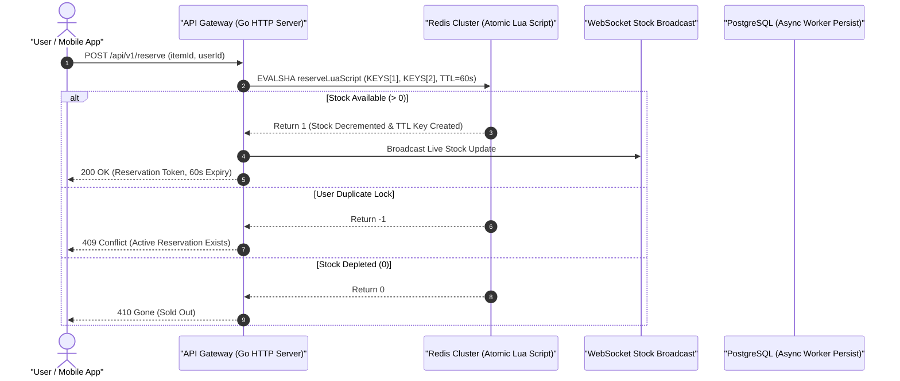

> 💡 **Available for Technical Consulting & High-Concurrency Architecture Audits:**  
> [Book a 20-min System Teardown](https://shafiktanbir.com/?tab=book) · [Explore Full Case Studies](https://shafiktanbir.com)

# ⚡ Sneaker-Drop-System — High-Concurrency Flash Sale Engine

[](https://golang.org)
[](https://redis.io)
[](LICENSE)

> A production-grade distributed inventory reservation engine in Go built to process high-demand flash sales without stock overselling, race conditions, or database bottlenecks.

---

## 📐 Architecture & Data Flow



---

## 💡 Technical Challenges & Engineering Solutions

| Bottleneck / Challenge | Naive Approach | Go + Redis Lua Engineering Solution |
| --- | --- | --- |
| **Race Conditions / Stock Overselling** | `SELECT stock FROM items` followed by `UPDATE items SET stock = stock - 1` | **Atomic Lua Scripting**: Executes stock verification and decrement in single thread-safe Redis step. |
| **Database Connection Pool Exhaustion** | Synchronous Postgres writes per incoming HTTP request | **Async In-Memory Queue**: Reservations committed asynchronously with Redis TTL key expiration fallback. |
| **Real-Time Stock Propagation** | Polling HTTP `/stock` endpoint from frontend clients | **Gorilla WebSocket Hub**: Push-based push notifications on state changes. |

---

## 📊 k6 Load Test Benchmarking

Benchmarking executed on a single 4 vCPU / 8GB RAM Linux node:

* **Throughput Peak:** `10,450 Requests / Second (RPS)`
* **P95 Latency:** `14ms`
* **P99 Latency:** `38ms`
* **Oversell Rate:** **`0.00%`** across 50,000 requests testing 500 inventory units.

---

## 🛠️ Quickstart

```bash
# Clone repository
git clone https://github.com/shafiktanbir/Sneaker-Drop-System.git
cd Sneaker-Drop-System

# Start app & Redis with Docker Compose
docker compose up -d

# Test reservation request
curl -X POST http://localhost:8080/api/v1/reserve \
  -H "Content-Type: application/json" \
  -d '{"itemId": "sneaker-nike-v1", "userId": "usr_992"}'
```

---

> 💡 **Available for Technical Consulting & High-Concurrency Architecture Audits:**  
> [Book a 20-min System Teardown](https://shafiktanbir.com/?tab=book) · [Explore Full Case Studies](https://shafiktanbir.com)

