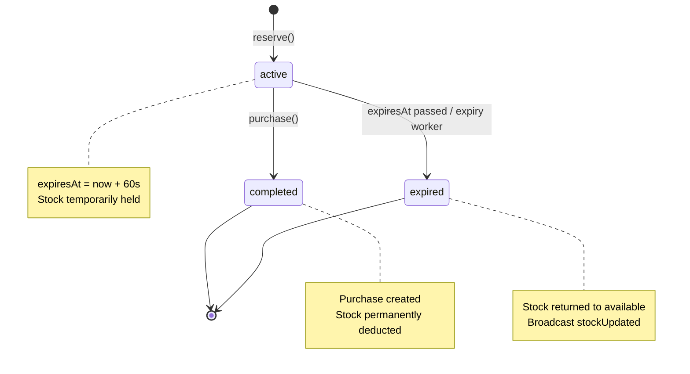
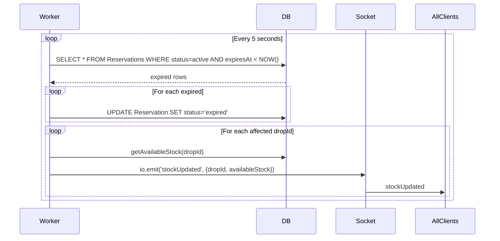

# Limited Edition Sneaker Drop — System Architecture & Design

This document describes the architecture, system design, and data flows of the real-time inventory system.

---

## Table of Contents

1. [High-Level Architecture](#1-high-level-architecture)
2. [Component Diagram](#2-component-diagram)
3. [Data Model & Entity Relationships](#3-data-model--entity-relationships)
4. [Reservation State Machine](#4-reservation-state-machine)
5. [Data Flows](#5-data-flows)
6. [Concurrency & Race Condition Handling](#6-concurrency--race-condition-handling)
7. [Real-Time Update Flow](#7-real-time-update-flow)
8. [Stock Calculation](#8-stock-calculation)
9. [Key Design Decisions](#9-key-design-decisions)

---

## 1. High-Level Architecture

```
┌─────────────────────────────────────────────────────────────────────────────────┐
│                           CLIENT (React + Vite)                                  │
│  App.jsx  │  DropCard  │  StockDisplay  │  ActivityFeed  │  useSocket  │  api   │
└─────────────────────────────────────┬───────────────────────────────────────────┘
                                      │
                         HTTP REST    │    WebSocket (Socket.io)
                         /api/*       │    stockUpdated, purchaseCompleted
                                      │
┌─────────────────────────────────────▼───────────────────────────────────────────┐
│                         SERVER (Express + Node.js)                               │
│  ┌─────────────┐  ┌──────────────────┐  ┌───────────────┐  ┌─────────────────┐  │
│  │ API Routes  │  │ reservationSvc   │  │ dropService   │  │ expiryService   │  │
│  │ drops       │  │ reserve()        │  │ createDrop()  │  │ expireReserv..  │  │
│  │ reservations│  │ purchase()       │  │ getDrops()    │  │ startWorker()   │  │
│  │ purchases   │  │ SELECT FOR UPDATE│  │ getStock()    │  │ every 5s        │  │
│  └──────┬──────┘  └────────┬─────────┘  └───────┬───────┘  └────────┬────────┘  │
│         │                  │                    │                    │           │
│         └──────────────────┴────────────────────┴────────────────────┘           │
│                                      │                                           │
│                            Socket.io (getIo)                                     │
└─────────────────────────────────────┬───────────────────────────────────────────┘
                                      │ Prisma ORM
┌─────────────────────────────────────▼───────────────────────────────────────────┐
│                         PostgreSQL (Neon)                                        │
│  Users  │  Drops  │  Reservations  │  Purchases                                 │
└─────────────────────────────────────────────────────────────────────────────────┘
```

---

## 2. Component Diagram

```mermaid
flowchart TB
    subgraph Client[Client - React]
        App[App]
        DropCard[DropCard]
        StockDisplay[StockDisplay]
        ActivityFeed[ActivityFeed]
        useSocket[useSocket Hook]
        api[api client]
        Toast[ToastContext]
    end

    subgraph Server[Server - Express]
        DropsRoute[drops.js]
        ReservRoute[reservations.js]
        PurchRoute[purchases.js]
        ReserveSvc[reservationService]
        DropSvc[dropService]
        ExpirySvc[expiryService]
        Socket[socket/index.js]
    end

    subgraph DB[(PostgreSQL)]
        Users[(Users)]
        Drops[(Drops)]
        Reservations[(Reservations)]
        Purchases[(Purchases)]
    end

    App --> DropCard
    App --> useSocket
    App --> api
    DropCard --> StockDisplay
    DropCard --> ActivityFeed
    DropCard --> api
    DropCard --> Toast

    api --> DropsRoute
    api --> ReservRoute
    api --> PurchRoute
    useSocket --> Socket

    DropsRoute --> DropSvc
    ReservRoute --> ReserveSvc
    PurchRoute --> ReserveSvc
    PurchRoute --> DropSvc

    ReserveSvc --> Reservations
    ReserveSvc --> Drops
    ReserveSvc --> Purchases
    ReserveSvc --> Users
    DropSvc --> Drops
    DropSvc --> Reservations
    DropSvc --> Purchases
    DropSvc --> Users
    ExpirySvc --> Reservations
    ExpirySvc --> Socket

    ReservRoute --> Socket
    PurchRoute --> Socket
```

---

## 3. Data Model & Entity Relationships

```mermaid
erDiagram
    Users ||--o{ Reservations : has
    Users ||--o{ Purchases : has
    Drops ||--o{ Reservations : has
    Drops ||--o{ Purchases : has
    Reservations ||--o| Purchases : "1:1 completed"

    Users {
        int id PK
        string username UK
        datetime createdAt
        datetime updatedAt
    }

    Drops {
        int id PK
        string name
        decimal price
        int totalStock
        datetime startsAt
        datetime endsAt
        datetime createdAt
        datetime updatedAt
    }

    Reservations {
        int id PK
        int dropId FK
        int userId FK
        enum status
        datetime expiresAt
        datetime createdAt
        datetime updatedAt
    }

    Purchases {
        int id PK
        int dropId FK
        int userId FK
        int reservationId FK_UK
        decimal amountPaid
        datetime createdAt
        datetime updatedAt
    }
```

### Entity Descriptions

| Entity | Purpose |
|--------|---------|
| **User** | Identity for purchasers; identified by unique username (3–50 alphanumeric chars). Auto-created on first reserve. |
| **Drop** | Merch product: name, price, totalStock. Optional startsAt/endsAt for time-windowed drops. |
| **Reservation** | Temporary hold. Status: `active`, `completed`, `expired`. expiresAt = created + 60 seconds. |
| **Purchase** | Completed sale. One per reservation (1:1). Stores amountPaid at purchase time. |

### Cascades

- Deleting a Drop cascades to Reservations and Purchases.
- Deleting a User cascades to their Reservations and Purchases.
- Deleting a Reservation cascades to its Purchase (if any).

---

## 4. Reservation State Machine



### Transitions

| From | To | Trigger |
|------|----|---------|
| — | `active` | User calls `POST /api/reservations`; available stock > 0 |
| `active` | `completed` | User calls `POST /api/purchases` within 60s |
| `active` | `expired` | 60s elapses; expiry worker (every 5s) marks it |

---

## 5. Data Flows

### 5.1 Reserve Flow (Sequence)

```mermaid
sequenceDiagram
    participant User
    participant DropCard
    participant API
    participant ReserveSvc
    participant DB
    participant Socket
    participant AllClients

    User->>DropCard: Click Reserve
    DropCard->>API: POST /api/reservations {dropId, username}
    API->>ReserveSvc: reserve(dropId, username)

    ReserveSvc->>DB: BEGIN; SELECT Drops FOR UPDATE
    ReserveSvc->>DB: COUNT active reservations, purchases
    ReserveSvc->>DB: available = totalStock - reserved - purchased
    alt available < 1
        ReserveSvc-->>API: OUT_OF_STOCK
    else available >= 1
        ReserveSvc->>DB: INSERT Reservation (status=active, expiresAt=now+60s)
        ReserveSvc->>DB: COMMIT
        ReserveSvc-->>API: {success, reservation}
    end

    API->>DB: getAvailableStock(dropId)
    API->>Socket: io.emit('stockUpdated', {dropId, availableStock})
    Socket->>AllClients: stockUpdated
    API-->>DropCard: 201 {success, reservation}
    DropCard->>User: Toast + show countdown
```

### 5.2 Purchase Flow (Sequence)

```mermaid
sequenceDiagram
    participant User
    participant DropCard
    participant API
    participant ReserveSvc
    participant DB
    participant Socket
    participant AllClients

    User->>DropCard: Click Complete Purchase
    DropCard->>API: POST /api/purchases {reservationId, username}
    API->>ReserveSvc: purchase(reservationId, username)

    ReserveSvc->>DB: BEGIN; SELECT Reservation FOR UPDATE
    ReserveSvc->>DB: Validate: active, not expired, userId match
    ReserveSvc->>DB: INSERT Purchase
    ReserveSvc->>DB: UPDATE Reservation status=completed
    ReserveSvc->>DB: COMMIT
    ReserveSvc-->>API: {success, purchase}

    API->>DB: getAvailableStock, getDropsWithStock (topPurchasers)
    API->>Socket: io.emit('stockUpdated', ...)
    API->>Socket: io.emit('purchaseCompleted', {dropId, topPurchasers})
    Socket->>AllClients: stockUpdated + purchaseCompleted
    API-->>DropCard: 201 {success, purchase}
    DropCard->>User: Toast + refresh
```

### 5.3 Expiry Flow (Background Worker)



---

## 6. Concurrency & Race Condition Handling

### Problem: Overselling

If 100 users click Reserve for the last item at the same time, only 1 must succeed.

### Solution: Row-Level Locking

**Reserve** — Lock the Drop row:

```sql
SELECT * FROM "Drops" WHERE id = $dropId FOR UPDATE
```

- Inside a Prisma transaction.
- Other transactions must wait until this one commits or rolls back.
- Serializes concurrent reserve attempts for the same drop.

**Purchase** — Lock the Reservation row:

```sql
SELECT r.*, d."price" FROM "Reservations" r
JOIN "Drops" d ON r."dropId" = d.id
WHERE r.id = $reservationId FOR UPDATE
```

- Prevents race with expiry worker (expiring vs purchasing).
- Ensures only one purchase per reservation.

### Error Mapping

| Condition | Prisma/Postgres | API Response |
|-----------|-----------------|--------------|
| Write conflict | P2034 | 409 CONCURRENT_UPDATE |
| Deadlock | 40P01 | 409 CONCURRENT_UPDATE |
| Lock timeout | 55P03 | 409 CONCURRENT_UPDATE |

Client shows toast: "Another user just took this item. Please try again."

### Double Reservation Prevention

If the same user already has an active reservation for the same drop:

- Extend `expiresAt` by 60 seconds (instead of creating a new reservation).
- Return the existing reservation.

---

## 7. Real-Time Update Flow

### WebSocket Events

| Event | Emitted By | Payload | Client Action |
|-------|------------|---------|---------------|
| `stockUpdated` | Reservations route, Purchases route, Expiry worker | `{ dropId, availableStock }` | Update drop's `availableStock` in state |
| `purchaseCompleted` | Purchases route | `{ dropId, username, topPurchasers }` | Update drop's `topPurchasers` in state |

### Client Update Logic

```
stockUpdated  → setDrops(prev => prev.map(d => d.id === dropId ? {...d, availableStock} : d))
purchaseCompleted → setDrops(prev => prev.map(d => d.id === dropId ? {...d, topPurchasers} : d))
```

### Connection

- **Dev**: Socket.io connects to `window.location.origin` (Vite dev server), which proxies `/socket.io` to backend.
- **Prod**: Socket.io connects to `VITE_SOCKET_URL` (backend URL).

---

## 8. Stock Calculation

Stock is **not stored**; it is computed on each read:

```
availableStock = totalStock - COUNT(active reservations) - COUNT(purchases)
```

Where:

- `totalStock` = Drops.totalStock
- `active reservations` = Reservations where status = 'active' AND expiresAt > now
- `purchases` = Purchases for that drop

Computed in:

- `dropService.getAvailableStock(dropId)`
- `dropService.getDropsWithStock()` (per drop)

---

## 9. Key Design Decisions

| Decision | Rationale |
|----------|-----------|
| **Stock as computed value** | Avoids sync bugs between reserved/purchased counts and a stored field. |
| **60-second reservation window** | Short enough to discourage hoarding, long enough to complete checkout. |
| **Expiry worker every 5s** | Balance between responsiveness and DB load. Max 5s delay before stock returns. |
| **SELECT FOR UPDATE** | Standard PostgreSQL row lock; robust under high concurrency. |
| **Single Socket.io namespace** | Broadcast to all clients; no per-drop rooms needed for this scale. |
| **Username-based identity** | No auth system; simple for demo. Production would use proper auth. |
| **Prisma over Sequelize** | Type-safe, good migrations, `$queryRaw` for FOR UPDATE. |
| **In-process expiry worker** | Simpler than cron; for multi-instance deploy, use a shared job queue. |

---

## Related Documentation

- [DOCUMENTATION.md](DOCUMENTATION.md) — API reference, setup, credentials
- [HOW_IT_WORKS.md](HOW_IT_WORKS.md) — User-facing flow guide
- [../README.md](../README.md) — Quick start
- [../PITFALLS_AND_FIXES.md](../PITFALLS_AND_FIXES.md) — Common pitfalls
